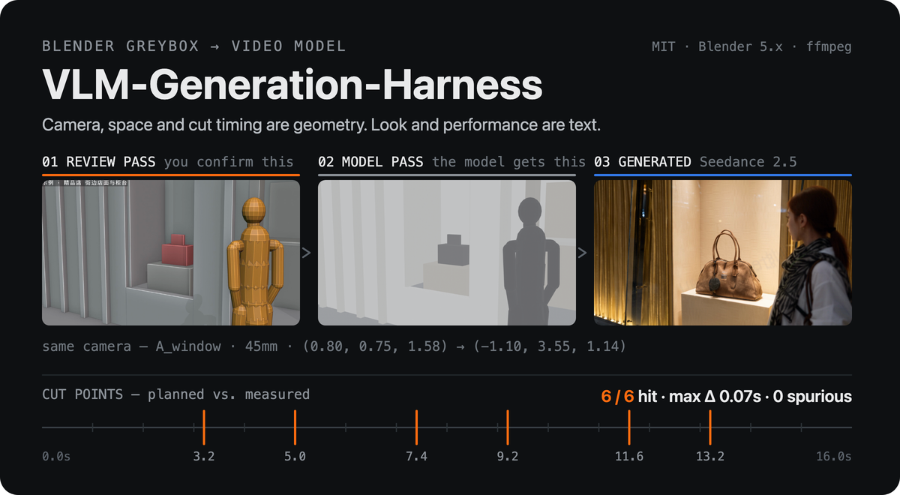
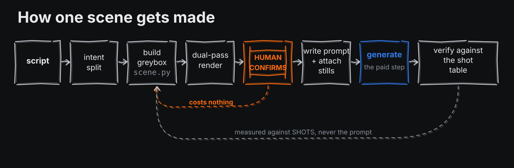
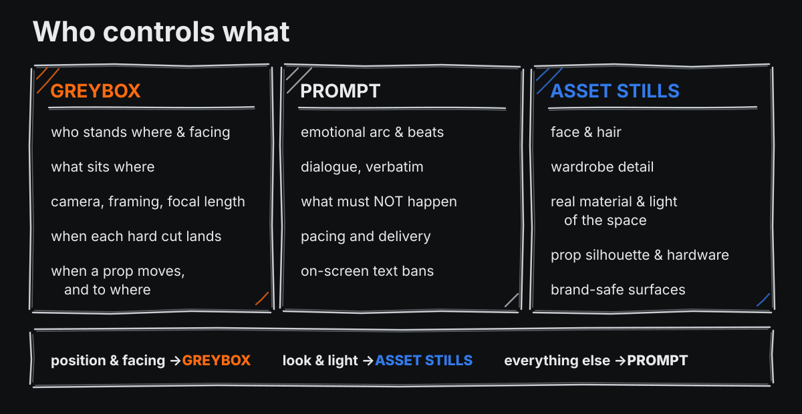

<p align="center">
  
</p>

<p align="center">
  <em>中文: <a href="README.md">README.md</a> &#183; the full documentation is in Chinese</em>
</p>

An AI video model gives you **one shot**. What you need is **a scene**: seven shots in the same room,
six hard cuts landing on the frames you chose, a prop that moves exactly once and only after the
payment beat, a character who walks left-to-right across three locations.

Those are **geometry and timing** problems, not description problems:

> **Space and time are controlled by geometry. Look and performance are controlled by text.
> Neither is allowed to cross into the other.**

Build the room out of grey boxes in Blender, set the cameras and the timeline, export a flat grey
video into the model's **video-reference channel**. Shape, material, light, acting and dialogue go
into the **prompt and asset stills**.

---

## Does it actually work

One 16-second greybox, 7 shots, 6 hard cuts, driving Seedance 2.5:

| planned | measured | delta |
|---:|---:|---:|
| 3.2s | 3.17s | 0.03s |
| 5.0s | 4.96s | 0.04s |
| 7.4s | 7.38s | 0.02s |
| 9.2s | 9.17s | 0.03s |
| 11.6s | 11.54s | 0.06s |
| 13.2s | 13.17s | 0.03s |

**6/6 hit, worst error 0.07s, zero spurious cuts.** All seven camera positions reproduced, no grey
geometry leaked into the render.

The failures are logged too, in [`docs/04-model-notes.md`](docs/04-model-notes.md): a clip containing
one 7.5-second take **missed 3 cuts and invented 4**. Long takes grow their own cuts.

## Pipeline

<p align="center">
  
</p>

The same geometry is rendered twice, and **the version a human reviews is not the version the model
receives**:

| | engine | audience |
|---|---|---|
| review pass | Workbench + outlines + semantic colour + burned-in shot IDs | human |
| model pass | EEVEE flat light, no outlines, no colour, no text | model |

A video reference is a **pixel** channel, not an instruction channel. Outlines, burned-in text and
saturated colour are all textures the model may reproduce — so the model gets the one that is harder
for humans to read. [Why →](docs/02-ironclad-rules.md)

Both passes share byte-identical **geometry**, so confirming position and cut timing on the review
pass is valid. They do **not** necessarily share **value contrast** — run `-- audit` and look at the
model pass itself (rule 15).

## Quick start

No API key needed to run the example:

```bash
git clone https://github.com/7ohnson/VLM-Generation-Harness.git
cd VLM-Generation-Harness/examples/boutique

blender -b --python scene.py -- audit         # model-pass value check
blender -b --python scene.py -- plan        out
blender -b --python scene.py -- review_anim /tmp/rev
blender -b --python scene.py -- anim        /tmp/mod
ffmpeg -framerate 24 -i /tmp/rev/f_%04d.png -pix_fmt yuv420p out/review.mp4
ffmpeg -framerate 24 -i /tmp/mod/f_%04d.png -pix_fmt yuv420p out/model.mp4

python3 ../../tools/check_prompt.py prompt.txt scene.py    # prompt lint
python3 ../../tools/verify_cuts.py out/model.mp4 scene.py  # cut verification
```

Start your own scene: `cp blockout/scene_template.py scenes/my_scene.py`.

## Division of labour — three layers

<p align="center">
  
</p>

| the greybox controls | the prompt controls | the asset stills control |
|---|---|---|
| who stands where, facing where | emotional arc and beats | face and hair |
| what sits where | dialogue, verbatim | every wardrobe detail |
| camera position, framing, focal length | pacing and delivery | the real material and light of the space |
| when each hard cut lands | what must not happen | prop silhouette, colour, hardware |
| when a prop moves, and to where | on-screen text bans | what brand marks look like (and which to erase) |

**One test: can you write it down as coordinates?** Yes → greybox. No, but you can photograph it
→ asset still. Neither → prompt.

The conflict rule goes into every prompt:

> **position and facing follow the greybox · look and light follow the asset stills ·
> everything else follows the prompt**

The asset layer is the one people underestimate. One photo of a bag beats three lines of
"brown suede, double top handles, rounded rectangular silhouette" — but it also drags **its own
lettering** in with it. Embossed logos, labels and shop signage leak into the render, and a textual
ban does not stop what is already in the picture
([troubleshooting](docs/05-troubleshooting.md)).

## Layout

| path | what |
|---|---|
| `SKILL.md` | entry point when used as a Claude Code skill (drop into `~/.claude/skills/`) |
| `blockout/` | Blender toolchain + scene template |
| `tools/` | cut verification, prompt linting, contact sheets, shot-boundary slicing |
| `templates/` | prompt skeleton, cross-clip space-lock skeleton |
| `examples/boutique/` | one complete 16s / 7-shot example |
| `docs/` | pipeline · ironclad rules · prompt spec · model notes · troubleshooting |

## Requirements

- **Blender 5.x** — uses the bundled Rigify armature for posable mannequins; no downloads
- **ffmpeg / ffprobe**
- **Python 3 + Pillow** (contact sheets only)
- A video model exposing both a video-reference and an image-reference channel
  (measured against Seedance 2.5; re-measure the checklist in `docs/04-model-notes.md` for others)

## When not to use this

Single shot, no cuts, space doesn't matter → just write a prompt. The cost here is an hour or two
of modelling per location. It pays off only when generation is expensive *and* one scene needs
several clips that must agree with each other.

## About the example assets

The example ships the **greybox only** (grey boxes, no third-party content), plus the prompt
skeleton and verification report. It does **not** include character boards, location plates or
product stills — those are copyrighted third-party material on my side. Supply your own:

- 1 character board (locks face and wardrobe)
- 1–2 empty-location plates (lock material and light)
- 1 still per key prop

The `@图片N` slots in `prompt.txt` are where they go.

## License

MIT
