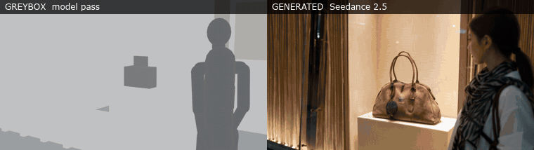
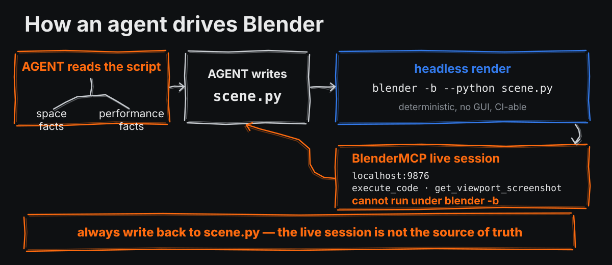

<p align="center">
  
</p>

<p align="center">
  <em>English: <a href="README.en.md">README.en.md</a></em>
</p>

AI 视频模型给你的是**一条镜头**。你要的是**一场戏**:同一个房间里的七个镜头、六次硬切落在你指定的帧上、
一件道具只在付款之后动一次、三个空间里人物统一从左往右走。

这些是**几何和时序问题**,不是描述问题。这套 harness 的做法是:

> **空间和时间用几何控制,长相和表演用文字控制,两者不许互相越界。**

在 Blender 里搭一个只有灰方块的房间,摆好机位和时间轴,导出一段灰模视频喂进模型的**参考视频通道**;
造型、材质、光、表演、台词交给 **prompt 和资产图**。

---

## 它到底管不管用

一条 16 秒、7 镜、6 次硬切的白模,驱动 Seedance 2.5:

| 白模计划切点 | 成片实测 | 偏差 |
|---:|---:|---:|
| 3.2s | 3.17s | 0.03s |
| 5.0s | 4.96s | 0.04s |
| 7.4s | 7.38s | 0.02s |
| 9.2s | 9.17s | 0.03s |
| 11.6s | 11.54s | 0.06s |
| 13.2s | 13.17s | 0.03s |

**6/6 命中,最大偏差 0.07 秒,零多余切点。** 七个机位逐个复现,成片里没有任何灰方块。

<p align="center">
  
</p>

<p align="center">
  <sub>左:喂给模型的平光灰模 &#183; 右:生成出来的成片 &#183; 同一条时间轴,同样的六次硬切<br>
  原始 mp4 在 <a href="./examples/pair/">examples/pair/</a></sub>
</p>

模型从左边那条能拿到的东西少得可怜 —— 剪影、位置、镜头在哪、第几帧切。
**它拿到的就是这些,而右边那条把这些全复现了。**
造型、材质、光、人长什么样,一个字都不在灰模里,全在 prompt 和资产图。

失败面一并记着,在 [`docs/04-model-notes.md`](docs/04-model-notes.md):
一条含 7.5 秒长镜的片子**漏了 3 个切点、自己加了 4 个**。长镜头会自己长出切点。

## 流程

<p align="center">
  
</p>

一份几何文件渲两遍,**给人看的那条和给模型看的那条不是同一条**:

| | 引擎 | 给谁 |
|---|---|---|
| 审片版 | Workbench + 描边 + 语义配色 + 烧镜号 | 人 |
| 送模版 | EEVEE 平光,无描边、无颜色、无文字 | 模型 |

参考视频是**像素通道**,不是说明书通道 —— 描边、烧字、饱和色都可能被抄进成片。
所以给模型的是那条人看着费劲的。[为什么 →](docs/02-ironclad-rules.md)

两条的**几何**逐字节一致,所以在审片版上确认位置和切点是有效的。
但**明度不一定一致** —— 跑一次 `-- audit` 再亲眼看一眼送模版(铁律 15)。

## 让 agent 开 Blender

<p align="center">
  
</p>

有两条通道,不是二选一,是分工:

| | 怎么跑 | 强在哪 | 弱在哪 |
|---|---|---|---|
| **headless 脚本** | `blender -b --python scene.py -- <mode>` | 确定性、可复现、能进 CI、能批量 | 看不到实时视口 |
| **BlenderMCP** | agent 通过 MCP 连一个**开着 GUI 的** Blender | 能看、能试、能截视口、一句一句改 | **在 `blender -b` 下起不来**;会话状态不可复现 |

**生产回路是 headless 的。MCP 是探索期和排查期的东西。**

接上 MCP:

```bash
# Blender 侧:装 addon，在 View3D 侧栏(N)的 BlenderMCP 面板点 Start
#            它起一个 socket server 在 localhost:9876，Blender 必须开着窗口

# agent 侧
claude mcp add blender -- uvx blender-mcp
claude mcp list
```

做灰模只用四个能力:`get_scene_info` / `get_object_info` / `execute_code` / `get_viewport_screenshot`。
**addon 自带的 Poly Haven、Hyper3D、Sketchfab、Hunyuan3D 全部关掉** ——
它们往场景里塞带贴图的成品模型,而灰模里出现一个 PBR 沙发,送模版就会把那个沙发的造型抄进成片。

agent 拿到剧本之后,**第一件事是分堆,不是建模**:

```
空间事实 → 白模      能用坐标写下来的
外观事实 → 资产图    写不成坐标、但能拍下来的
表演事实 → prompt    两样都不行的
```

然后按这个顺序:抽时间轴(`SHOTS` 表)→ 定坐标约定 → 建外壳 → 摆人 → 道具跟着手放
→ 算机位(不试机位)→ 跑 `audit`/`blockers`/`plan` → 渲审片版交给人。
**到这一步为止一分钱没花。**

### 唯一一条纪律

> **live 会话不是真相,`scene.py` 才是。**

agent 在 MCP 会话里 `execute_code` 挪了一把椅子,那个改动只存在于那个 Blender 进程里 ——
关掉就没了,而且 `scene.py` 完全不知道。**live 里试通的每一个改动都必须回写进 `scene.py`,
然后 headless 从零跑一遍验证。** live 会话是草稿纸,`scene.py` 是稿子。

完整的接入方式、可以直接抄的探查代码、什么时候该停下来问人 →
[`docs/06-agent-integration.md`](docs/06-agent-integration.md)

## 上手

跑通例子不需要任何 API key:

```bash
git clone https://github.com/7ohnson/VLM-Generation-Harness.git
cd VLM-Generation-Harness/examples/boutique

blender -b --python scene.py -- audit         # 送模版明度自检
blender -b --python scene.py -- plan        out
blender -b --python scene.py -- review_anim /tmp/rev
blender -b --python scene.py -- anim        /tmp/mod
ffmpeg -framerate 24 -i /tmp/rev/f_%04d.png -pix_fmt yuv420p out/review.mp4
ffmpeg -framerate 24 -i /tmp/mod/f_%04d.png -pix_fmt yuv420p out/model.mp4

# 把白模事实导出来，让 prompt 自检能做「三层对账」
blender -b --python scene.py -- export /tmp/facts.json
python3 ../../tools/check_prompt.py prompt.txt scene.py --facts /tmp/facts.json
python3 ../../tools/verify_cuts.py out/model.mp4 scene.py
```

`check_prompt.py` 查三组东西:**结构**(章节、时间码、硬切次数、语速)、
**颗粒度**(每一镜够不够密、有没有不可证伪的形容词、负面约束覆盖了几类)、
**三层一致**(白模算出来的景别和分镜写的对不对得上、每张资产图有没有声明取舍边界)。
详见 [prompt 规范](docs/03-prompt-spec.md)。

开自己的场景:`cp blockout/scene_template.py scenes/my_scene.py`。

## 分工 · 三层

<p align="center">
  
</p>

| 白模控制 | prompt 控制 | 资产图控制 |
|---|---|---|
| 谁站在哪、面朝哪 | 情绪起点、句内变化、句尾落点 | 脸与发型 |
| 什么东西放在哪 | 台词逐字 | 服装的每一件细节 |
| 机位、景别、焦距 | 节奏与语速 | 空间的真实材质与光 |
| 第几秒切一刀 | 不许做的动作 | 道具的轮廓、颜色与五金 |
| 道具什么时候动、动到哪 | 屏幕不许出字这类禁令 | 品牌字样长什么样(以及要抹掉哪些) |

**判据只有一条:这件事能不能用坐标写下来?** 能 → 白模;不能,但能拍下来 → 资产图;
两样都不行 → prompt。

冲突规则写死在每条 prompt 里:

> **位置与朝向听白模的 · 长相与光听资产图的 · 其余听 prompt 的**

资产图是最容易被低估的一层。一张包的照片胜过三行「棕色麂皮、双提手、圆润长方轮廓」——
但它会**连自己身上的字一起带进来**,品牌压印、标签、店招都会漏进成片。
文字禁令挡不住图里已经有的东西([排查](docs/05-troubleshooting.md))。

## 目录

| 路径 | 是什么 |
|---|---|
| `SKILL.md` | 作为 Claude Code skill 的入口(丢进 `~/.claude/skills/`) |
| `blockout/` | Blender 工具链 + 场景模板 |
| `tools/` | 切点核验、prompt 自检(结构 + 颗粒度 + 三层对账)、接触表、按镜号切片 |
| `templates/` | prompt 骨架、跨条空间锁骨架 |
| `examples/boutique/` | 一条完整的 16 秒 7 镜例子(可跑) |
| `examples/pair/` | 上面那段对照的原始 mp4:灰模 + 成片 |
| `docs/` | [流程](docs/01-pipeline.md) · [15 条铁律](docs/02-ironclad-rules.md) · [prompt 规范](docs/03-prompt-spec.md) · [模型实测](docs/04-model-notes.md) · [排查](docs/05-troubleshooting.md) · [agent 接入](docs/06-agent-integration.md) |

**动手前先读 [15 条铁律](docs/02-ironclad-rules.md)** —— 每一条都是花过钱或返过工换来的。

## 依赖

- **Blender 5.x** —— 用自带的 Rigify 做人体代理骨架,无需下载任何模型资产
- **ffmpeg / ffprobe**
- **Python 3 + Pillow**(只有接触表用)
- 一个提供「参考视频 + 参考图」两个通道的视频生成模型
  (实测对象是 Seedance 2.5;换模型要重测 [`docs/04-model-notes.md`](docs/04-model-notes.md) 里那份清单)

## 不适用的情况

单镜头、无切点、空间不重要的片子,直接写 prompt 更快。

这套东西的成本是**每个场景一两小时建模**,换来的是切点可控和跨条空间一致。
只有当「出片贵」且「一场戏要出好几条」时才划算。

## 示例里没有什么

只有**白模**(灰方块,不涉及任何版权)、prompt 骨架和核验报告。
**没有定妆板、空镜、商品实物图** —— 那些在我这边是第三方版权素材。你需要自己准备:

```
@图片1  人物定妆板     锁脸、发型、服化道
@图片2  空镜           锁空间的材质与光
@图片3  道具实物图     锁轮廓、颜色、五金
```

`examples/boutique/prompt.txt` 里的槽位就是留给它们的。
hero 第三格那帧成片是用我自己的资产跑出来的,不在仓库里。

## License

MIT
