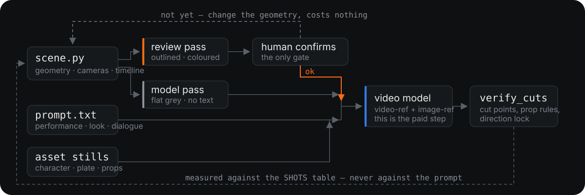

# 流程

```
剧本
 └─ 1 意图读取      从剧本里抠出「空间事实」和「表演事实」，分开放
 └─ 2 建白模        Blender 里把房间、机位、走位、切点搭出来
 └─ 3 双通道渲染    审片版给人看 · 送模版给模型看 · 平面图看调度
 └─ 4 人 confirm    ← 唯一的闸门。过不了就回第 2 步，不花钱
 └─ 5 写 prompt     白模管不了的东西(表演、台词、材质、光)在这里补齐
 └─ 6 挂资产图      物件长什么样交给实物图，不靠文字描述
 └─ 7 打包生成      白模走 --video 通道，资产图走 --image 通道
 └─ 8 核验          切点、道具规则、方向锁，逐条量，不靠印象
```

<p align="center">
  
</p>

核心主张只有一句:**空间和时间用几何控制，长相和表演用文字控制,两者不许互相越界。**

---

## 1. 意图读取

从剧本里分**三**堆:

| 空间事实 → 白模 | 表演事实 → prompt | 外观事实 → 资产图 |
|---|---|---|
| 谁站在哪、面朝哪 | 情绪起点、句内变化、句尾落点 | 脸与发型 |
| 什么东西放在哪 | 台词逐字 | 服装的每一件细节 |
| 镜头在哪、什么景别、焦距 | 节奏与语速 | 空间的真实材质与光 |
| 第几秒切一刀 | 不许做的动作 | 道具的轮廓、颜色与五金 |
| 道具什么时候动、动到哪 | 屏幕不许出字这类禁令 | 品牌字样(以及要抹掉哪些) |

**判据:这件事能不能用坐标写下来?** 能 → 白模;不能但能拍下来 → 资产图;两样都不行 → prompt。

**分错的代价**:把「木色偏暖」写进白模是白写(白模没有颜色);
把「她在他左边还是右边」交给文字,模型有一半概率放反;
把「这只包长什么样」交给形容词,五金和轮廓每一条都会漂。

剧本里那些「不可漂移」的锁——道具在哪只手、袋面朝哪、人物统一从左往右——**同时是空间事实和表演事实**,两边都要写。

## 2. 建白模

`blockout/scene_template.py` 是骨架。一个物理空间一个文件，里面只有几何、机位、时间轴。

顺序很重要，**每一步都先算再渲**:

```bash
blender -b --python scene.py -- probe      # 人体关节的实测坐标 → 道具放这里
blender -b --python scene.py -- project    # 每个元素在画面的位置/占幅/距离 → 定焦距
blender -b --python scene.py -- blockers   # 谁挡住了谁
blender -b --python scene.py -- plan  out  # 俯视图 + 视锥 → 看有没有越轴
```

看渲染图猜焦距、猜遮挡，是这套流程里最容易翻车的地方。数字不会骗人。

## 3. 双通道渲染

同一份几何渲两遍，**只有显示方式不同**:

| | 引擎 | 给谁看 |
|---|---|---|
| **审片版** `review` / `review_anim` | Workbench + 描边 + 空腔 + 投影 + 语义配色 + 烧镜号 | 人 |
| **送模版** `anim` | EEVEE 平光，无描边、无颜色、无文字 | 生成模型 |

为什么要分开 → 见 [`02-ironclad-rules.md`](02-ironclad-rules.md) 的「双通道」一节。

两条的**几何**逐字节一致，所以在审片版上确认**位置、朝向、机位、切点**是有效的。
但**明度不一定一致**:审片版靠描边和语义配色分层，送模版只有明度。
所以 confirm 之后还要:

```bash
blender -b --python scene.py -- audit    # 谁和谁在送模版里会糊成一片
```

再亲眼看一遍送模版。**「几何一致」不等于「信息一致」。**

## 4. 人 confirm

这是整条流程存在的理由:**在花钱之前把错误拦下来**。

审片版视频 + 平面图交给人过一遍。过不了就回第 2 步改几何，重渲一次的成本是几分钟电费。
过了才进第 5 步。

## 5. 写 prompt

规范见 [`03-prompt-spec.md`](03-prompt-spec.md)。要点:

- 时间码**从场景文件的 SHOTS 表抄**,不要手打
- 「硬切」的次数必须等于「镜头数 − 1」
- 写完用 `tools/check_prompt.py` 对着场景文件自检

## 6. 挂资产图

物件长什么样，用实物图，不要用形容词。一张包的照片胜过三行「棕色麂皮、双提手、圆润长方轮廓」。

但资产图会**连它身上的字一起带进来** —— 品牌压印、标签、店招。
文字禁令挡不住参考图里已经存在的东西(见 [`05-troubleshooting.md`](05-troubleshooting.md))。

## 7. 打包生成

```
白模 mp4  → 生成模型的「参考视频」通道
资产图    → 「参考图」通道，顺序就是 prompt 里的 @图片1/2/3…
prompt    → 文本通道
```

具体命令取决于你用哪个模型/服务，见 [`04-model-notes.md`](04-model-notes.md)。

## 8. 核验

```bash
python3 tools/verify_cuts.py   成片.mp4 scene.py    # 切点 vs 白模时间轴
python3 tools/contact_sheet.py 成片.mp4 -o s.png --scene scene.py
```

**核验数据必须从场景文件取,不能从 prompt 取。** prompt 的时间码本来就是照着场景文件抄的，
拿它验 prompt 是循环验证——我干过一次，一个错都没查出来，实际上后半段已经飘了 1 秒。

除了切点，还要逐条量剧本里的硬锁:道具在哪只手、只动了一次没有、方向有没有反。
